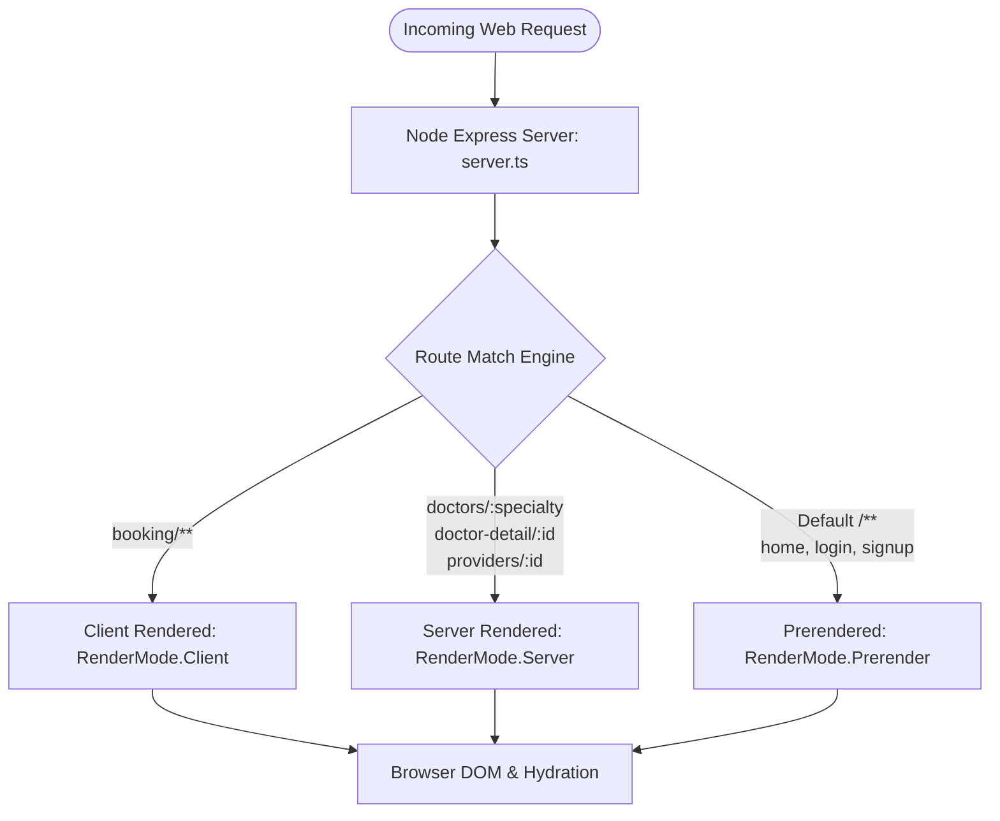
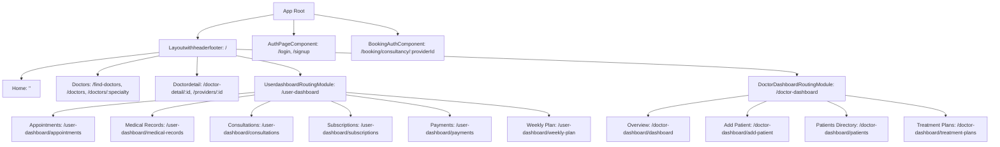
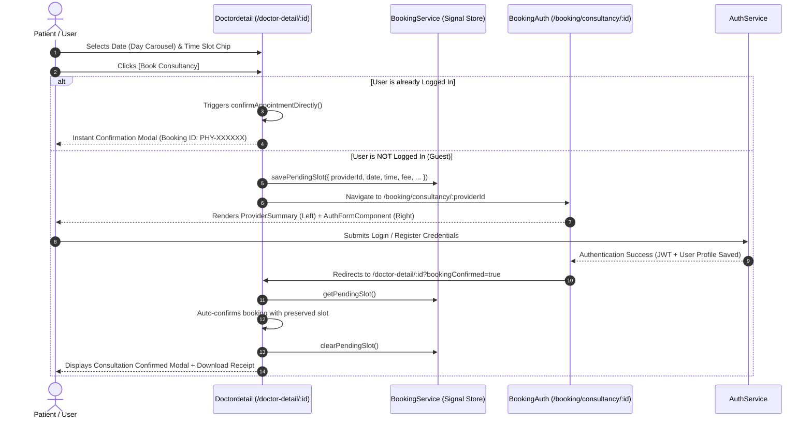

# PhysiosMate — Complete System Architecture & Technical Documentation

> **PhysiosMate** is a modern, enterprise-grade digital physiotherapy and physical rehabilitation platform.  
> It connects patients with certified physiotherapists and specialized clinics, providing intelligent practitioner discovery, slot booking, multi-phase treatment protocol management, patient health records, and a doctor clinical caseload dashboard.

---

## Table of Contents

1. [Executive Summary & Core Principles](#1-executive-summary--core-principles)
2. [Technology Stack & Key Libraries](#2-technology-stack--key-libraries)
3. [System Architecture & Hybrid Rendering (SSR / CSR / SSG)](#3-system-architecture--hybrid-rendering-ssr--csr--ssg)
4. [Project Directory & File Structure](#4-project-directory--file-structure)
5. [Routing Architecture & Navigation Map](#5-routing-architecture--navigation-map)
6. [Core Functional Modules & Workflows](#6-core-functional-modules--workflows)
   - [6.1 Discovery & Provider Catalog](#61-discovery--provider-catalog)
   - [6.2 End-to-End Booking Lifecycle](#62-end-to-end-booking-lifecycle)
   - [6.3 Authentication & Authorization](#63-authentication--authorization)
   - [6.4 Patient Portal (`/user-dashboard`)](#64-patient-portal-user-dashboard)
   - [6.5 Doctor Clinical Dashboard (`/doctor-dashboard`)](#65-doctor-clinical-dashboard-doctor-dashboard)
   - [6.6 Web Push Notification Engine](#66-web-push-notification-engine)
7. [Service Layer & API Integration](#7-service-layer--api-integration)
8. [Data Models & TypeScript Schemas](#8-data-models--typescript-schemas)
9. [UI/UX & Layout Architecture](#9-uiux--layout-architecture)
10. [Environment Configuration & Build Pipelines](#10-environment-configuration--build-pipelines)

---

## 1. Executive Summary & Core Principles

PhysiosMate is engineered as an Angular 20 standalone application with Node/Express Server-Side Rendering (SSR). It addresses the full lifecycle of musculoskeletal therapy:

```
┌──────────────────────────────────────────────────────────────────────────────────────────┐
│                                       PHYSIOSMATE                                        │
├───────────────────────────────┬───────────────────────────────┬──────────────────────────┤
│       PATIENT DISCOVERY       │       BOOKING & REHAB         │     CLINICAL PRACTICE    │
│  • Search by specialty & city │  • Sticky slot picker (days)  │  • Patient caseload dir  │
│  • Clinic & doctor profiles   │  • Guest state preservation   │  • Multi-phase protocols │
│  • Verified credentials & bio │  • In-Clinic & Video consult  │  • Today's appointment flow│
│  • Ratings & patient stories  │  • Weekly exercise regimens   │  • Dynamic KPI analytics │
└───────────────────────────────┴───────────────────────────────┴──────────────────────────┘
```

### Architectural Guiding Principles:
1. **Single Source of Truth for Auth Forms**:  
   `AuthFormComponent` is a reusable, layout-agnostic component. It is embedded into both standalone authentication (`/login`, `/signup`) and transactional checkout (`/booking/consultancy/:providerId`), eliminating duplicated auth logic.
2. **State Preservation Across Route Handoffs**:  
   When unauthenticated users select an appointment slot, `BookingService` snapshots their selection using Angular Signals and `sessionStorage`. After completing authentication, users are returned directly to the confirmation state without losing their chosen slot.
3. **SSR-Safe Browser Code**:  
   All browser-specific APIs (`localStorage`, `sessionStorage`, `navigator`, `window`, `document`) are shielded behind `isPlatformBrowser(platformId)` or typeof checks, preventing SSR hydration errors.
4. **Standalone Component Architecture**:  
   Built entirely using Angular's standalone components, standalone routing, and functional HTTP interceptors, with minimal legacy module dependencies.

---

## 2. Technology Stack & Key Libraries

| Layer / Concern | Technology | Version | Purpose |
|---|---|---|---|
| **Core Framework** | Angular (Standalone Components) | `^20.1.0` | Frontend application architecture |
| **Language** | TypeScript | `~5.8.2` | Strongly typed development |
| **Server-Side Rendering** | `@angular/ssr` + Express | `^20.1.5` / `^5.1.0` | Universal rendering, SEO pre-rendering & Node server |
| **Hydration** | Client Hydration with Event Replay | Angular 20 | Instant interactivity without visual flickers |
| **Reactive State** | Angular Signals & RxJS | Signals + `~7.8.0` | Fine-grained reactivity and asynchronous stream handling |
| **CSS & Design System** | Bootstrap + Custom CSS | `^5.3.8` | Responsive layout grid and customized clinical UI |
| **Carousels & Swipers** | Swiper | `^14.2.0` | Touch-friendly image and slot carousels |
| **Feedback & Dialogs** | SweetAlert2 | `^11.26.25` | Standardized dialogs, confirmation modals, toasts |
| **Push Notifications** | Web Push API + Service Worker | Native | Browser-level push notification subscriptions |
| **Build System** | `@angular/build` (Vite / esbuild) | `^20.1.5` | High-speed builds and development bundling |

---

## 3. System Architecture & Hybrid Rendering (SSR / CSR / SSG)

The application utilizes Angular's hybrid server routing configured in [`src/app/app.routes.server.ts`](file:///d:/PersonalProjects/physiosmateweb/src/app/app.routes.server.ts):



### Rendering Strategies:
- **`RenderMode.Prerender`**: Static pages (`/`, `/find-doctors`, `/login`, `/signup`) are compiled to static HTML at build time for maximum speed and instant SEO indexing.
- **`RenderMode.Server`**: Dynamic directory pages (`/doctors/:specialty`, `/doctor-detail/:id`, `/providers/:id`) are rendered on-demand on the server per request, ensuring search engines index updated doctor profiles.
- **`RenderMode.Client`**: Transactional or highly personalized routes (`/booking/**`, `/user-dashboard/**`, `/doctor-dashboard/**`) execute purely in the browser.

---

## 4. Project Directory & File Structure

```
physiosmateweb/
├── public/                                  # Static public assets (icons, robots, service worker)
├── src/
│   ├── app/
│   │   ├── auth/                            # Authentication components
│   │   │   ├── auth-form/                   # Reusable login/signup form (reactive validation)
│   │   │   └── auth-page/                   # Standalone centered login/signup wrapper
│   │   │
│   │   ├── authinterceptor/                 # HTTP Interceptors
│   │   │   └── authinterceptor.ts           # Injects JWT Bearer token into outgoing HTTP calls
│   │   │
│   │   ├── booking/                         # Booking funnel & checkout
│   │   │   ├── booking-auth/                # Split layout: Provider summary + Auth form
│   │   │   ├── provider-summary/            # Doctor profile preview for checkout context
│   │   │   └── booking.service.ts           # Signal-based booking state manager + storage
│   │   │
│   │   ├── environment/                     # Environment configuration
│   │   │   └── environment.ts               # Base API URLs, Image CDNs, VAPID public key
│   │   │
│   │   ├── helper/                          # Shared utilities and component barrels
│   │   │   ├── registerComponent.ts         # Component array exports for layout imports
│   │   │   └── utilities.ts                 # Helper methods
│   │   │
│   │   ├── models/                          # TypeScript interfaces and entity classes
│   │   │   ├── apiresponse.ts               # Generic API response wrapper: ApiResponse<T>
│   │   │   ├── authmodel.ts                 # User authentication session and role metadata
│   │   │   ├── doctor-dashboard.model.ts    # Clinical patients, treatment phases, appointments, KPI stats
│   │   │   ├── practitioner.model.ts        # Doctors, clinics, filters, catalog plans, booking state
│   │   │   ├── push-subscription.model.ts   # Web push subscription DTOs
│   │   │   └── usermode.ts                  # Patient appointments, consultancies, exercises, plans
│   │   │
│   │   ├── pages/                           # Application views
│   │   │   ├── doctor-dashboard/            # Doctor clinical portal
│   │   │   │   ├── addpatient/              # New patient intake form with clinical red flags
│   │   │   │   ├── doctordashboard/         # KPI stats, today's schedule, quick actions
│   │   │   │   ├── patients/                # Active caseload directory & profile viewer
│   │   │   │   ├── treatmentplans/          # Multi-phase protocol progress tracker
│   │   │   │   ├── doctor-dashboard-module.ts
│   │   │   │   └── doctor-dashboard-routing-module.ts
│   │   │   │
│   │   │   ├── doctordetail/                # Comprehensive doctor profile & slot booking page
│   │   │   ├── doctors/                     # Search directory with filters (gender, city, fee, rating)
│   │   │   ├── home/                        # Landing page with hero search, specialties, testimonials
│   │   │   ├── layout/                      # Global UI frame
│   │   │   │   ├── footer/                  # Site footer with directory links
│   │   │   │   ├── header/                  # Global navigation bar with profile dropdown & auth state
│   │   │   │   ├── sidebar/                 # Mobile off-canvas navigation
│   │   │   │   └── layoutwithheaderfooter/  # Main layout wrapper hosting <router-outlet>
│   │   │   │
│   │   │   └── userdashboard/               # Patient personal health portal
│   │   │       ├── patient-appointments/    # Upcoming & past consultation listings
│   │   │       ├── patient-consultancy/     # In-Clinic & Video call cards with prescriptions
│   │   │       ├── patient-medicalrecords/  # Downloadable clinical reports & assessments
│   │   │       ├── patient-subscription/   # Multi-session therapy package cards
│   │   │       ├── patient-transaction/    # Invoice records & receipts
│   │   │       ├── patient-weeklyappointmentplan/ # Day-by-day prescribed exercise schedule
│   │   │       ├── user-dashboard/          # Main patient dashboard tab controller
│   │   │       ├── userdashboard-module.ts
│   │   │       └── userdashboard-routing-module.ts
│   │   │
│   │   ├── services/                        # Business logic and HTTP services
│   │   │   ├── authservice.ts               # Login, registration, OTP, JWT session management
│   │   │   ├── doctor-dashboard.service.ts  # Doctor caseload, treatment plan, stats API
│   │   │   ├── explore.service.ts           # Doctor/clinic search, profile lookup, slug generators
│   │   │   ├── loader.ts                    # Global loading indicator state (Signal & BehaviorSubject)
│   │   │   ├── masterservice.ts             # Master lookups: roles, specialties, cities, languages
│   │   │   ├── provider-catalog.service.ts  # Rehab packages and clinical expertise catalogs
│   │   │   ├── push-notification.service.ts # Service worker push subscriptions
│   │   │   ├── sweet-alert.service.ts       # SweetAlert2 toast & modal alerts
│   │   │   └── userservice.ts               # Patient bookmarks, bookings, subscriptions
│   │   │
│   │   ├── shared/                          # Shared components & modules
│   │   │   ├── components/
│   │   │   │   └── notification-toggle/     # Push notification subscription toggle button
│   │   │   └── shared-module.ts             # CommonModule, FormsModule, ReactiveFormsModule barrel
│   │   │
│   │   ├── app.config.server.ts             # Server application configuration
│   │   ├── app.config.ts                    # Client application config (Router, Hydration, HTTP Interceptor)
│   │   ├── app.routes.server.ts             # Server render mode specifications (SSR / Prerender / Client)
│   │   ├── app.routes.ts                    # Application client route tree
│   │   ├── app.ts / app.html / app.css      # Root component
│   │   └── main.server.ts / main.ts         # Bootstrap entry points
│   └── server.ts                            # Express server bootstrap for SSR
├── angular.json                             # Angular CLI build & workspace configuration
├── package.json                             # Dependencies and npm scripts
└── tsconfig.json                            # TypeScript compiler settings
```

---

## 5. Routing Architecture & Navigation Map

The routing architecture separates public content (rendered with Header and Footer) from focused checkout/auth workflows and dashboard portals:



### Route Specifications:

| Path | Component / Module | Layout Frame | Access Control | Render Mode |
|---|---|---|---|---|
| `/` | `Home` | Full Header & Footer | Public | Prerender |
| `/find-doctors`, `/doctors` | `Doctors` | Full Header & Footer | Public | Prerender |
| `/doctors/:specialty` | `Doctors` | Full Header & Footer | Public | SSR (Server) |
| `/doctor-detail/:id` | `Doctordetail` | Full Header & Footer | Public | SSR (Server) |
| `/providers/:id` | `Doctordetail` | Full Header & Footer | Public (Canonical) | SSR (Server) |
| `/login`, `/signup` | `AuthPageComponent` | Minimal Centered Card | Public | Prerender |
| `/booking/consultancy/:providerId` | `BookingAuthComponent` | 2-Column Checkout | Public / Guest | Client |
| `/user-dashboard/**` | `UserdashboardRoutingModule` | Full Header & Footer | Authenticated Patient | Client |
| `/doctor-dashboard/**` | `DoctorDashboardRoutingModule` | Full Header & Footer | Authenticated Doctor | Client |
| `**` | Redirect to `/` | — | Fallback | Prerender |

---

## 6. Core Functional Modules & Workflows

### 6.1 Discovery & Provider Catalog
- **Location & Search State**: Dynamic city selector (`Jaipur`, `Kota`, `Mumbai`, `Delhi NCR`, `Bangalore`, `Pune`) and search query tracking across navigation pages.
- **Provider Filtering**: Filter practitioners by gender, experience level, fee threshold, rating score, and verified status.
- **SEO-Friendly Slugs**: `ExploreService.createSlug(name, id)` creates slugs like `dr-sneha-sharma-1`, while `extractIdFromSlug()` cleanly parses the numeric identifier.
- **Single-Page Scroll Spy**: The Doctor Detail page implements a dynamic scroll spy with sticky navigation across 6 sections:
  1. `info` (Doctor Bio, Clinic Details, Education, Experience)
  2. `stories` (Patient Feedback & Ratings)
  3. `plans` (Rehab Packages & Subscription Offerings)
  4. `treatments` (Searchable Surgeries & Clinical Treatments)
  5. `photos` (Clinic Facility Gallery)
  6. `qa` (Consultation Q&A)

---

### 6.2 End-to-End Booking Lifecycle

The booking funnel handles both authenticated users and guest visitors seamlessly:



#### Booking Confirmation Modal UI
Upon successful reservation, the confirmation modal presents:
- Unique Reference ID (`PHY-XXXXXX`)
- Assigned Practitioner Name & Photo
- Clinic Name & Address
- Chosen Date & Time Slot
- Consultation Fee & Payment Mode (`Pay at Clinic`)
- Actions: **Download Receipt** (triggers `window.print()`) and **Done**

---

### 6.3 Authentication & Authorization

The authentication system supports email, mobile number, OTP-based verification, and role-based permissions:

```
┌─────────────────────────────────────────────────────────────┐
│                      AUTH ARCHITECTURE                      │
├──────────────────────────────┬──────────────────────────────┤
│       STANDALONE AUTH        │       BOOKING CONTEXT        │
│          (/login)            │ (/booking/consultancy/:id)   │
│                              │                              │
│   ┌──────────────────────┐   │  ┌──────────┬─────────────┐  │
│   │   AuthPageComponent  │   │  │ Provider │  AuthForm   │  │
│   │  ┌────────────────┐  │   │  │ Summary  │  Component  │  │
│   │  │ AuthFormComp   │  │   │  │  (Left)  │   (Right)   │  │
│   │  └────────────────┘  │   │  └──────────┴─────────────┘  │
│   └──────────────────────┘   │                              │
└──────────────────────────────┴──────────────────────────────┘
```

#### Key Capabilities:
- **`AuthFormComponent`**: Reusable component handling form switching (`login` vs `signup`), password visibility toggles, phone/email validation, and OTP submission.
- **`authInterceptor`**: HTTP interceptor that reads JWT from `localStorage` (SSR-safe via `isPlatformBrowser`) and injects:
  ```http
  Authorization: Bearer <token>
  ```
- **Session Model**: Serialized `user` object in `localStorage` containing `id`, `fullName`, `email`, `mobile`, `roleId`, `clinicId`, and `practitionerId`.

---

### 6.4 Patient Portal (`/user-dashboard`)

A centralized, responsive patient dashboard equipped with bidirectional route-to-tab synchronization:

```mermaid
graph LR
    Dashboard[/user-dashboard] --> Appts[PatientAppointments]
    Dashboard --> Cons[PatientConsultancy]
    Dashboard --> Subs[PatientSubscription]
    Dashboard --> Records[PatientMedicalrecords]
    Dashboard --> Txn[PatientTransaction]
    Dashboard --> Plan[PatientWeeklyappointmentplan]
```

1. **Appointments Tab** (`appointments`): Filter upcoming vs past appointments, view appointment status (`Scheduled`, `In-Progress`, `Completed`), clinic details, and cancel/reschedule actions.
2. **Consultations Tab** (`consultations`): Detailed consultation history for both in-clinic visits and tele-rehab video calls, with diagnosis notes and prescription access.
3. **Subscriptions Tab** (`subscriptions`): Active physical therapy packages showing progress percentages, completed sessions out of total, validity dates, and payment status (`Paid`, `Partial`, `Pending`).
4. **Medical Records Tab** (`medical-records`): Categorized clinical records (Prescriptions, Physical Assessments, X-Ray/MRI, Lab Tests, Discharge Summaries) with file size metadata and download triggers.
5. **Payments Tab** (`payments`): Invoices, amounts, transaction dates, payment methods, and receipt downloads.
6. **Weekly Exercise Plan Tab** (`weekly-plan`): Customized day-by-day physical therapy regimen (e.g., Spine stabilization, Knee isometric holds) with target areas, sets, durations, difficulty levels, and completion checkboxes.

---

### 6.5 Doctor Clinical Dashboard (`/doctor-dashboard`)

A dedicated clinical interface for practitioners to manage patient cohorts, protocols, and appointments:

#### 1. Real-Time Dynamic KPI Analytics:
Toggle between **Day**, **This Week**, **Month**, and **Lifetime** views:
- Total Appointments, Completed Appointments, Completion Rate (`%`)
- Active Patient Caseload & New Patients
- Gross Clinical Revenue & Pending Payment Collections
- Average Practitioner Rating & Total Reviews

#### 2. Today's Appointment Schedule:
Live status transition control for each patient:
```
[Scheduled]  ──▶  [In-Progress]  ──▶  [Completed]
```
*When marked as `Completed`, the patient's completed sessions count automatically increments, and the linked Treatment Plan progress bar advances.*

#### 3. New Patient Intake Workflow (`Addpatient`):
Clinical onboarding form capturing:
- Basic demographics (Name, Age, Gender, DOB, Phone, Email, Emergency Contact)
- Primary Clinical Condition & Chief Complaint
- Condition Severity (`Mild`, `Moderate`, `Severe`)
- Medical Red Flags (Contraindications) & Relevant Medical History
- Precautionary Notes & Clinical Goals
- Assigned Treatment Plan Template

#### 4. Patient Directory (`Patients`):
Searchable list of registered patients displaying their condition, current plan, session progression (`6/12 Sessions`), last visit date, and direct contact options.

#### 5. Multi-Phase Treatment Protocols (`Treatmentplans`):
Structured multi-phase rehabilitation plans:
- **Phase 1: Acute Relief & Symptom Reduction** (Weeks 1–2)
- **Phase 2: Deep Core Isometric Activation** (Weeks 3–4)
- **Phase 3: Functional Dynamic Loading & Return to Activity** (Weeks 5–6)

#### 6. Clinical Consultations & Prescriptions (`Consultations`):
Dedicated clinical consultation recording and billing interface:
- **Left Patient Search Panel**: Real-time patient lookup by name, phone, or code with quick auto-fill selection and "+ New Walk-in Patient" toggle.
- **Auto-Filled Patient & Billing Details**: Patient contact info, condition, and auto-populated consultation fees (e.g. ₹500, with status: Paid, Pending, Waived).
- **Comprehensive Clinical Examination**: Chief complaint, quick preset diagnoses (Lumbar disc herniation, Frozen shoulder, ACL post-op), pain severity rating (Mild, Moderate, Severe), and vitals (BP, pulse, ROM restrictions).
- **Rehab Protocol & Prescription Slip**: Prescribed care plan, exercise instructions, follow-up date, and printable physical therapy prescription slip with electronic seal.
- **Recent Consultations Ledger**: Log of logged assessments with direct slip printing.

#### 7. Appointments & Inquiries Scheduler (`DoctorAppointments`):
Dual-purpose scheduling panel handling active appointments and prospective leads:
- **Left Patient Search Directory**: Search registered patients or inquiries to auto-fill details.
- **Clinical Appointment Mode**: Schedule in-clinic, video call, or home visit sessions with time slot chips, target condition, and fee tracking.
- **General Inquiry Mode (No Consultation Bill)**: Records patient inquiries, preferred packages, priority levels, and callback reminders without creating an active clinical consultation entry.
- **Tabbed Schedule Ledger**: Switch between Today's Scheduled Appointments, Inquiries & Follow-up Leads (with one-click "Convert to Appointment" action), and Completed sessions.

---

### 6.6 Web Push Notification Engine

Configured via [`PushNotificationService`](file:///d:/PersonalProjects/physiosmateweb/src/app/services/push-notification.service.ts) and [`NotificationToggle`](file:///d:/PersonalProjects/physiosmateweb/src/app/shared/components/notification-toggle):

1. **Browser Compatibility Check**: Ensures `serviceWorker`, `PushManager`, and `Notification` exist in the browser context.
2. **Permission Request**: Prompts user for native browser notification permission.
3. **VAPID Key Handshake**: Encodes `environment.vapidPublicKey` to `Uint8Array` for application server verification.
4. **Backend Sync**: Dispatches payload containing `endpoint`, `p256dh` key, and `auth` secret to:
   - `POST /api/Push/Subscribe`
   - `POST /api/Push/Unsubscribe`

---

## 7. Service Layer & API Integration

All HTTP services interact with the backend API configured in [`environment.ts`](file:///d:/PersonalProjects/physiosmateweb/src/app/environment/environment.ts):

```
Base API URL:      https://musicapi.deftinstitute.in/api/
Image Base URL:    http://localhost:7146/wwwroot/images/
VAPID Public Key:  BNTEku-vHB8wAcUL0nptC1SMZDg9r9lqJYHBtX1I8lt2P8aqRjwKE0DtPoLRypnIiCF5phdU-b0gfXveBeATiT0
```

### Key Services:

```
┌───────────────────────────┬───────────────────────────────────────────────────────────────┐
│ Service                   │ Primary Responsibilities & API Endpoints                      │
├───────────────────────────┼───────────────────────────────────────────────────────────────┤
│ Authservice               │ • POST Auth/Login, POST Auth/Register                         │
│                           │ • POST Auth/VerifyOtp, POST Auth/ResendOtp                    │
│                           │ • Local storage token management, isLoggedIn(), logout()      │
├───────────────────────────┼───────────────────────────────────────────────────────────────┤
│ ExploreService            │ • POST Explore/GetPractitioners, GET Explore/GetPractitionerById│
│                           │ • POST Explore/GetClinics, GET Explore/GetClinicById          │
│                           │ • Slug generation: createSlug(), extractIdFromSlug()          │
├───────────────────────────┼───────────────────────────────────────────────────────────────┤
│ BookingService            │ • Signal-based state: bookingState                            │
│                           │ • SessionStorage backup: savePendingSlot(), getPendingSlot()  │
│                           │ • Booking reference generator: PHY-XXXXXX                     │
├───────────────────────────┼───────────────────────────────────────────────────────────────┤
│ DoctorDashboardService    │ • GET Doctor/Patients, GET Doctor/Patient?id=x                │
│                           │ • POST Doctor/AddPatient                                      │
│                           │ • GET Doctor/TreatmentPlans, POST Doctor/AddTreatmentPlan     │
│                           │ • GET Doctor/Appointments, POST Doctor/UpdateAppointmentStatus│
│                           │ • GET Doctor/Stats?period={day|week|month|lifetime}           │
├───────────────────────────┼───────────────────────────────────────────────────────────────┤
│ Userservice               │ • POST User/SavePractitioner, GET User/SavedPractitioners     │
│                           │ • GET Consultancy/GetAvailability?practitionerId=x           │
│                           │ • POST Consultancy/BookConsultancy, GET Consultancy/MyBookings│
│                           │ • POST User/AddUserSubscription, POST User/GetUserSubscription│
├───────────────────────────┼───────────────────────────────────────────────────────────────┤
│ ProviderCatalogService    │ • POST ProviderCatalog/GetAllExpertise                        │
│                           │ • POST ProviderCatalog/GetProviderPlans                       │
├───────────────────────────┼───────────────────────────────────────────────────────────────┤
│ Masterservice             │ • GET Master/GetAllRoles, GET Master/GetAllSpecialization     │
│                           │ • GET Master/GetAllServices, GET Master/GetAllLanguage        │
│                           │ • GET Master/GetAllQualification                              │
│                           │ • GET Master/GetAllState, GET Master/GetAllCity?stateId=x     │
├───────────────────────────┼───────────────────────────────────────────────────────────────┤
│ PushNotificationService   │ • PushManager subscription, permission checking               │
│                           │ • POST Push/Subscribe, POST Push/Unsubscribe                  │
├───────────────────────────┼───────────────────────────────────────────────────────────────┤
│ SweetAlertService         │ • success(), error(), warning(), info()                       │
│                           │ • toastSuccess(), toastError(), toastWarning(), toastInfo()   │
│                           │ • confirm(), confirmDelete(), showLoading(), closeLoading()   │
├───────────────────────────┼───────────────────────────────────────────────────────────────┤
│ Loader                    │ • Centralized isLoading signal + isLoading$ BehaviorSubject   │
│                           │ • startLoader(), stopLoader(), forceStopLoader()              │
└───────────────────────────┴───────────────────────────────────────────────────────────────┘
```

---

## 8. Data Models & TypeScript Schemas

The application enforces strong typing across all data layers:

### 1. Practitioner & Clinic Models ([`practitioner.model.ts`](file:///d:/PersonalProjects/physiosmateweb/src/app/models/practitioner.model.ts))
- **`PractitionerSummary`**: Compact listing data (id, fullName, profileImage, specialization, experienceYears, fee, avgRating, clinicName).
- **`PractitionerDetailedData`**: Full profile model including services, languages, degrees/qualifications, and subscription plans.
- **`ClinicSummary` & `ClinicDetailedData`**: Facility listings, gallery items, address, ratings, and associated practitioners.
- **`BookingState`**: Transient booking model tracking chosen provider, date, time slot, and reference ID.

### 2. Clinical Dashboard Models ([`doctor-dashboard.model.ts`](file:///d:/PersonalProjects/physiosmateweb/src/app/models/doctor-dashboard.model.ts))
- **`DoctorPatient`**: Patient code (`PT-1041`), condition, status, completed/total sessions, red flags, emergency contacts.
- **`DoctorTreatmentPlan` & `DoctorTreatmentPhase`**: Plan codes (`PLN-301`), duration, frequency, clinical notes, and multi-phase progression.
- **`DoctorAppointment`**: Booking codes (`BKG-7721`), patient reference, time slot, visit type (`In-Clinic` vs `Video Call`), session number.
- **`DoctorStats`**: Aggregate analytics (revenue, completion rate, patient counts).

### 3. Patient Portal Models ([`usermode.ts`](file:///d:/PersonalProjects/physiosmateweb/src/app/models/usermode.ts))
- **`MyBooking`**: Booking record with assigned practitioner, clinic name, slot times, and visit type.
- **`ConsultancyItem`**: Consultation record with diagnosis, prescription availability, and notes.
- **`SubscriptionPlanItem`**: Rehab packages with session progress and payment status.
- **`MedicalReportItem`**: Clinical documents (Prescriptions, MRIs, Lab tests).
- **`DayPlan` & `DayExercise`**: Daily exercise routines with targets, sets, duration, and completion status.

### 4. Auth & Response Wrappers ([`authmodel.ts`](file:///d:/PersonalProjects/physiosmateweb/src/app/models/authmodel.ts), [`apiresponse.ts`](file:///d:/PersonalProjects/physiosmateweb/src/app/models/apiresponse.ts))
- **`apiresponse<T>`**: Standardized response container (`isSuccess`, `message`, `data`, `responseCode`).
- **`authmodel`**: Authenticated user session object with role identifiers, clinic/practitioner links, and JWT token.

---

## 9. UI/UX & Layout Architecture

### Layout Strategy
1. **Standard Layout (`Layoutwithheaderfooter`)**:
   - `<app-header>`: Sticky top navigation with city selector, search input, notifications toggle, and dynamic auth button / user profile avatar dropdown.
   - `<app-sidebar>`: Responsive off-canvas navigation menu for mobile viewports.
   - `<main class="main-content-container">`: Hosts routed views via `<router-outlet>`.
   - `<app-footer>`: Directory links, clinical categories, legal notices, and contact info.
2. **Minimalist Checkout Layout (`BookingAuthComponent`)**:
   - Split two-column presentation specifically tailored for high checkout conversion.
   - Left column displays practitioner credentials, clinic location, and selected consultation fee.
   - Right column hosts `AuthFormComponent` to log in or register without navigating away.
3. **Standalone Auth Layout (`AuthPageComponent`)**:
   - Clean, centered container displaying the brand logo and `AuthFormComponent`.

---

## 10. Environment Configuration & Build Pipelines

### Environment Configuration
Found in `src/app/environment/environment.ts`:
```typescript
export const environment = {
    baseUrl: 'https://musicapi.deftinstitute.in/api/',
    baseImageUrl: 'http://localhost:7146/wwwroot/images/',
    vapidPublicKey: 'BNTEku-vHB8wAcUL0nptC1SMZDg9r9lqJYHBtX1I8lt2P8aqRjwKE0DtPoLRypnIiCF5phdU-b0gfXveBeATiT0'
};
```

### Available Scripts:
```bash
# 1. Start local development server (Client with proxy / live reload)
npm start
# or
ng serve

# 2. Build production bundle (client + server bundles in dist/)
npm run build

# 3. Serve the SSR production build locally
npm run serve:ssr:physiosmateweb

# 4. Run unit tests with Karma runner
npm test
```

---

*Last Comprehensive Review: September 2026*  
*Document Version: 2.0.0*  
*Maintained by: PhysiosMate Engineering Core Team*
